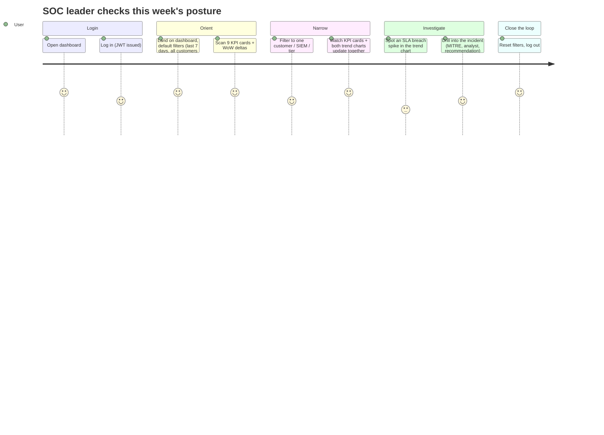
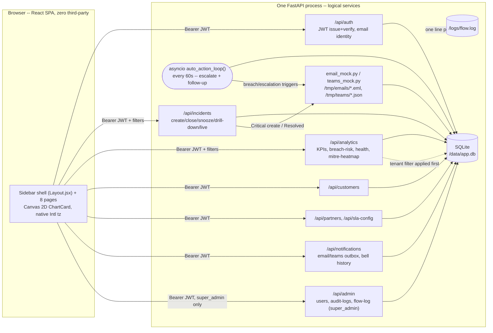
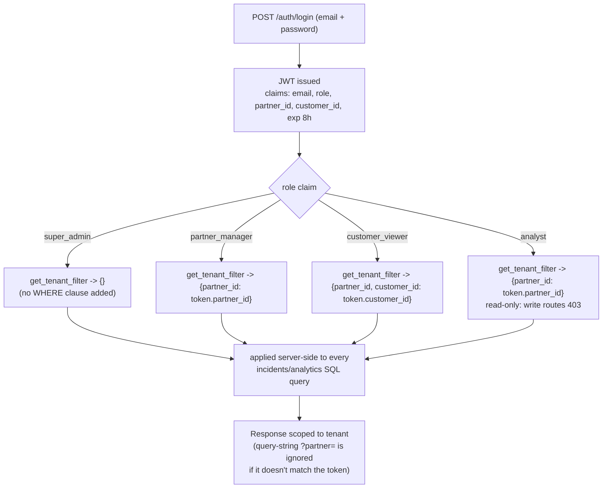

# Solution Architecture — PulseSOC (SOC Executive Command Center)

_Filled by `solution-architect`. Every decision needs a WHY, not just a what._

## Stack
| Layer | Choice | WHY |
|---|---|---|
| Backend | FastAPI (single process, logically many services) | Async request handling matters here — the analytics endpoint aggregates over up to 90 days / 5,000 rows on every filter change, and FastAPI's async I/O keeps that from blocking other tenants' requests. The same async runtime hosts a background `asyncio.create_task` loop (`auto_action_loop`, 60s interval) for breach auto-escalation — no Celery/task-queue dependency needed. One process is a deliberate build decision, not an architecture ceiling — see below. |
| Database | SQLite, file-based (`/data/app.db`) | One file, trivial to seed/reset/back up for a demo, zero infra to stand up. All timestamps stored as UTC ISO8601; the frontend converts to the viewer's chosen timezone (IST/UTC/EST/GMT) for display only — filtering always happens in UTC server-side. `DB_TYPE` env toggle (`sqlite` default, `mongo` stubbed) documents the migration path without spending build time on it. |
| Frontend | React + Vite — **zero third-party runtime dependencies** | No dayjs/moment (native `Intl.DateTimeFormat.formatToParts()` instead), no chart library (hand-rolled Canvas 2D `ChartCard.jsx` — line/bar/stacked-bar/donut, with click-region hit-testing so every chart drills into a filtered view), no email/Teams SDK (mocked to local files, see Notifications below). Fully offline/air-gapped: no CDN fonts, no external calls. React Router v6 for the 8-page sidebar SPA (`Layout.jsx` + `AppContext.jsx`). |
| Auth | JWT (8h expiry, bcrypt, email identity) | Stateless — no server-side session store needed, which matters because tenant scope (`partner_id`/`customer_id`) travels inside the token claims and is re-checked on every request. 8h matches a SOC analyst's shift length (deliberately longer than the factory template's generic 1h default, since a shift-long token is the right fit for this specific use case). Identity is `email`, not `username` — every `users` row and JWT payload key is `email`. |

### Why "microservices" but one FastAPI process
The API is organized as logical services — `/api/auth`, `/api/incidents`,
`/api/analytics`, `/api/customers`, `/api/partners`, `/api/sla-config`,
`/api/notifications`, `/api/admin` — each with its own router, own repository, own
service-layer module. Standing up eight separate containers (eight Dockerfiles,
service discovery, inter-service auth) burns build time on infrastructure instead
of on KPI correctness and RBAC, which are what's actually being judged. The logical
boundary is real, though: each router only calls its own service module, no
cross-router imports. Splitting these into separate containers later is a
docker-compose and repository-per-folder exercise, not a rewrite — this is the
sellable part: "same code, one process today, N containers whenever your ops team
wants that."

## Diagram 1 — User Journey


## Diagram 2 — System Architecture


## Diagram 3 — RBAC Flow


## RBAC Matrix
| Role | Partner Scope | Customer Scope | Can see filters | Can drill-down | Can see PII |
|---|---|---|---|---|---|
| `super_admin` | `*` (all partners) | `*` (all customers) | all | yes | yes |
| `partner_manager` | `partner_id = <own>` | all customers within own partner | all, pre-scoped to own partner | yes | yes |
| `customer_viewer` | `partner_id = <own>` | `customer_id = <own>` only | range/SIEM/SOAR/tier only (customer is fixed) | yes, own customer only | yes, own customer only |
| `analyst` | `partner_id = <own>` | all customers within own partner | all, pre-scoped to own partner | yes | yes (read-only elsewhere: no `/admin`, no writes) |

`get_tenant_filter(current_user)` is the single function every repository query
runs through — it returns a dict merged into the SQL WHERE clause server-side. A
query-string `?partner=` that doesn't match the token's own scope is **ignored**,
not honored — this is what makes tenant isolation a server-side guarantee instead
of a client convention.

## DB Schema (SQLite)

All timestamps below are UTC ISO8601 strings. `db.py` migrates an existing SQLite
file idempotently at startup (`_migrate()`, checked via `PRAGMA table_info()`) —
`users.username` → `users.email` and the new `incidents`/`partners` columns are
added in place, so a demo doesn't need a full reseed after a schema change.

```sql
CREATE TABLE users (
    id INTEGER PRIMARY KEY AUTOINCREMENT,
    email TEXT UNIQUE NOT NULL,
    password_hash TEXT NOT NULL,              -- bcrypt
    role TEXT NOT NULL CHECK(role IN ('super_admin','partner_manager','customer_viewer','analyst')),
    partner_id TEXT,                          -- NULL only for super_admin
    customer_id TEXT                          -- NULL unless role = customer_viewer
);

CREATE TABLE partners (
    id INTEGER PRIMARY KEY AUTOINCREMENT,
    partner_name TEXT NOT NULL,
    partner_id TEXT UNIQUE NOT NULL,
    contact_email TEXT,
    teams_webhook_url_mock TEXT,               -- defaults to https://teams.mock/{partner_id}
    created_at TEXT NOT NULL,
    is_active INTEGER NOT NULL DEFAULT 1
);

CREATE TABLE customers (
    id INTEGER PRIMARY KEY AUTOINCREMENT,
    customer_id TEXT UNIQUE NOT NULL,
    customer_name TEXT NOT NULL,
    partner_id TEXT NOT NULL,
    service_tier TEXT NOT NULL CHECK(service_tier IN ('Gold','Silver','Bronze')),
    siem TEXT NOT NULL CHECK(siem IN ('QRADAR','XSIAM')),
    soar TEXT NOT NULL CHECK(soar IN ('XSOAR','Resilient'))
);

CREATE TABLE sla_configs (
    id INTEGER PRIMARY KEY AUTOINCREMENT,
    partner_id TEXT NOT NULL,
    customer_id TEXT,                         -- NULL = partner-wide default
    severity TEXT NOT NULL CHECK(severity IN ('Critical','Major','Minor')),
    sla_minutes INTEGER NOT NULL,
    created_by TEXT,
    created_at TEXT NOT NULL
);

CREATE TABLE incidents (
    id INTEGER PRIMARY KEY AUTOINCREMENT,
    ticket_number TEXT UNIQUE NOT NULL,
    partner TEXT NOT NULL,
    customer TEXT NOT NULL,
    severity TEXT NOT NULL CHECK(severity IN ('Critical','Major','Minor','Informational')),
    status TEXT NOT NULL,
    service_type TEXT NOT NULL,
    siem TEXT NOT NULL,
    soar TEXT NOT NULL,
    sla_result TEXT CHECK(sla_result IN ('Matched','Breached','none')),
    event_time TEXT NOT NULL,
    created_time TEXT NOT NULL,
    opened_time TEXT,                         -- NULL if never opened
    first_response_time TEXT,                 -- NULL if never responded
    closed_time TEXT,                         -- NULL if still open
    assigned_analyst TEXT,
    category TEXT,
    summary TEXT,
    mitre_techniques TEXT,                    -- comma-separated
    false_positive INTEGER NOT NULL DEFAULT 0,-- boolean 0/1
    escalation_level INTEGER NOT NULL DEFAULT 0, -- 0=none, 1=auto-escalated, 2=follow-up opened
    escalated_at TEXT,
    snoozed_until TEXT,                       -- NULL or a future ISO timestamp
    snooze_count INTEGER NOT NULL DEFAULT 0   -- capped at 2 -- resolve after that, don't keep snoozing
);

-- Zero-third-party notification mocks: no SMTP/webhook network call, just a
-- real file on disk (see Notifications below) plus this proof-of-send row.
CREATE TABLE email_outbox (
    id INTEGER PRIMARY KEY AUTOINCREMENT,
    to_email TEXT NOT NULL,
    subject TEXT NOT NULL,
    body TEXT NOT NULL,
    ticket_number TEXT NOT NULL,
    status TEXT NOT NULL,
    created_at TEXT NOT NULL,
    sent_at TEXT NOT NULL
);

CREATE TABLE teams_outbox (
    id INTEGER PRIMARY KEY AUTOINCREMENT,
    partner_id TEXT NOT NULL,
    webhook_url_mock TEXT NOT NULL,
    payload_json TEXT NOT NULL,               -- MessageCard-shaped JSON
    ticket_number TEXT NOT NULL,
    status TEXT NOT NULL,
    created_at TEXT NOT NULL
);

CREATE TABLE notifications (               -- bell/history feed, both channels
    id INTEGER PRIMARY KEY AUTOINCREMENT,
    ticket_number TEXT NOT NULL,
    type TEXT NOT NULL,                       -- 'Email' | 'Teams'
    message TEXT NOT NULL,
    is_read INTEGER NOT NULL DEFAULT 0,
    created_at TEXT NOT NULL
);

CREATE TABLE audit_logs (
    id INTEGER PRIMARY KEY AUTOINCREMENT,
    user TEXT NOT NULL,
    action TEXT NOT NULL,
    tenant_filter TEXT,
    details TEXT,
    timestamp TEXT NOT NULL
);
```

`DB_TYPE=sqlite` (default) or `DB_TYPE=mongo` env var selects the repository
implementation — the service layer (`analytics_service.py`) never touches SQL/Mongo
directly, only the repository interface, so the KPI math doesn't change when the
storage does.

`sla_configs` resolution order (see `sla_config_repository.resolve_sla_minutes`):
customer-specific override → partner-wide default → global default
(Critical=240min, Major=480min, Minor=1440min).

## Auto-escalation loop (`auto_action.py`)

A single `asyncio.create_task(auto_action_loop())` launched at FastAPI startup —
no Celery, no external scheduler. Every 60 seconds (`CHECK_INTERVAL_SECONDS`),
`check_breaches()`:
1. Resets any `snoozed_until` that's now in the past, so blinking resumes on its own.
2. Finds incidents newly past their `BLINKING` threshold and fires a "Blinking"
   email/Teams mock (deduplicated against `notifications` so it only fires once).
3. Auto-escalates incidents that are `BREACHED` (`escalation_level → 1`, reassigns
   to `super_admin`, fires an "Escalated" mock).
4. If a `BREACHED` ticket at `escalation_level == 1` stays unresolved 10+ more
   minutes (`FOLLOWUP_THRESHOLD_MINUTES`), opens a `FOLLOWUP-<ticket>` incident and
   bumps `escalation_level → 2`.

## Notifications (zero third-party)

`email_mock.py` / `teams_mock.py` replace an email library / the Teams SDK: no
`smtplib` connection, no webhook `POST` over the network. Each writes a real file
to disk (`/tmp/emails/{ticket}_{trigger}.eml`, `/tmp/teams/{ticket}_{trigger}.json`)
plus an `email_outbox`/`teams_outbox` DB row and a `notifications` row for the bell
feed — independently verifiable by a judge without any network access. Triggered on
Critical-incident creation, breach escalation/follow-up, and manual "Send Email"
from the Incidents page.

## KPI Computation Logic — assumptions documented

All computed in `compute_kpis(filters)` in `app/services/analytics_service.py`,
against whatever `[from, to]` range + tenant filter + customer/SIEM/SOAR/tier
filters are active.

| KPI | Formula | Assumption |
|---|---|---|
| **Alerts** | `COUNT(*) WHERE created_time BETWEEN from AND to` | Every row that reaches PulseSOC counts as an alert, regardless of whether it becomes an incident |
| **Critical Alerts** | Alerts `WHERE severity = 'Critical'` | — |
| **Incidents** | `COUNT(*) WHERE opened_time IS NOT NULL AND created_time BETWEEN from AND to` | The alert→incident funnel: an alert only becomes a counted "incident" once an analyst opens it |
| **Avg MTTD** | `AVG(created_time - event_time)`, minutes, incidents with both times | MTTD = detection latency: how long between the SIEM seeing it (`event_time`) and PulseSOC creating the ticket (`created_time`) |
| **Avg MTTR** | `AVG(closed_time - opened_time)`, hours, `WHERE closed_time IS NOT NULL` | Only closed incidents count — an open incident has no resolution time yet, including it would bias MTTR down |
| **SLA Compliance %** | `Matched / (Matched + Breached) * 100` | `sla_result = 'none'` (never opened) is excluded entirely — you can't breach an SLA clock that never started |
| **SLA Breaches** | `COUNT(*) WHERE sla_result = 'Breached'` | — |
| **False-Positive Rate** | `COUNT(*) WHERE false_positive = true / Alerts * 100` | A row is flagged false-positive if it was closed in under 15 minutes without ever being opened, OR an analyst explicitly marked it — both cases are pre-computed into the `false_positive` column at seed/ingest time, not derived at query time. Seed data targets 15% |
| **P1/P2/P3 Avg Response** | Map `Critical→P1, Major→P2, Minor→P3`; `AVG(first_response_time - opened_time)` per bucket | Informational severity has no P-bucket and isn't included in this KPI |
| **Week-over-week delta** | `(current_week - previous_week) / previous_week * 100` | Computed identically for every KPI above, using the same filter set shifted back 7 days; division-by-zero (previous_week = 0) reports `null`, rendered as "—" not "∞%" |

## SLA Breach Predictor — formula (`breach_predictor.py`)

Forward-looking, not backward-looking — `sla_result` above tells you what already
breached; this tells you what's about to, while there's still time to act.

```
severity_weight = Critical:30, Major:20, Minor:10   (Informational has no SLA target, never scored)
pct             = elapsed_minutes / sla_target_minutes * 100
breach_history  = COUNT(this customer's Breached incidents, last 30 days)
risk_score      = pct*0.6 + severity_weight*0.3 + (breach_history*5)*0.1

risk =
  SNOOZED  if snoozed_until is set and still in the future
  BREACHED if remaining_minutes < 0
  BLINKING if remaining_minutes <= 5 (Critical) or <= 15 (Major)
  HIGH     if risk_score > 75
  MEDIUM   if 50 <= risk_score <= 75
  LOW      otherwise
```

`BLINKING` is what drives the war-room banner and the blinking ticket chip.
Snoozing sets `blinking_critical = False` and `risk = SNOOZED` until the snooze
window passes, at which point the 60s background loop (above) picks it back up.

## Customer Health Score — formula (`health_score.py`)

One QBR-ready number per customer, 30-day window:

```
fp_rate      = false_positive_count / alerts * 100
volume_spike = (this_week_count - last_week_count) / last_week_count
               (1.0 if this_week_count>0 and last_week_count==0, else 0.0)

health = 100 - breaches*12 - fp_rate*0.6 - avg_mttr_h*1.5 - max(0, volume_spike)*10
health = clamp(health, 0, 100)

status = Healthy (health>80) | At Risk (50<=health<=80) | Critical (health<50)
anomaly = volume_spike > 0.5
```

The `volume_spike` term is what the older KPI-only view missed: two customers can
have identical breach/FP/MTTR numbers but one just had a 3x ticket-volume week —
that's a real health signal an account manager needs surfaced before the QBR, not
just a coincidence buried in the raw count.

## API Contract

| Method | Path | Purpose |
|---|---|---|
| `POST` | `/api/auth/login` | Sync login (email + password) — returns JWT immediately |
| `POST` | `/api/auth/login-async` | Async login — returns `job_id`, poll for result |
| `GET` | `/api/auth/status/{job_id}` | Poll result of an async login |
| `GET` | `/api/auth/me` | Current user's identity + scope (email, role, partner_id, customer_id) |
| `GET` | `/api/incidents` | List incidents — query params: `customer, siem, soar, tier, from, to, partner` (tenant-filtered server-side regardless of `partner` param) |
| `GET` | `/api/incidents/drill-down` | Same shape as `/api/incidents`, up to 500 rows — the Incidents page's own contract |
| `GET` | `/api/incidents/live?since=` | Incidents created after `since` — for live-ticker style polling |
| `GET` | `/api/incidents/{id}` | Drill-down: full incident detail incl. MITRE techniques, analyst, recommendation, escalation_level |
| `POST` | `/api/incidents/create` | analyst/super_admin only — creates a ticket (`SENT-<year>-<n>`), immediately opened so it enters the breach countdown; Critical severity also fires the email+Teams mocks |
| `POST` | `/api/incidents/{id}/close` | Closes a ticket, computes `sla_result` against the effective SLA target, logs SLA SAVED/BREACHED, fires a "Resolved" mock |
| `POST` | `/api/incidents/{id}/snooze` | Snoozes blinking/alerting for N minutes (max 2 snoozes, then must resolve) |
| `GET` | `/api/analytics/kpis` | Same filters → all 9 KPIs + WoW deltas |
| `GET` | `/api/analytics/trends` | `?metric=volume\|mttr&bucket=auto\|daily` → bucketed series (`bucket=daily` feeds the Dashboard's 30-day chart regardless of the global filter's range) |
| `GET` | `/api/analytics/breach-risk` | SLA Breach Predictor — open incidents sorted by `risk_score`, incl. `risk` (SNOOZED/BREACHED/BLINKING/HIGH/MEDIUM/LOW) |
| `GET` | `/api/analytics/customer-health` | Customer Health Score — one row per customer, 30-day window, incl. `volume_spike`/`anomaly` |
| `GET` | `/api/analytics/mitre-heatmap` | Technique tag counts for the Threat Landscape heatmap |
| `GET` | `/api/customers` | Reference data — customers visible to the caller's tenant scope |
| `GET` | `/api/sla-config?partner=` | Current SLA overrides for a partner (tenant-scoped) |
| `POST` | `/api/sla-config` | super_admin/partner_manager (own partner only) — set a per-partner or per-customer SLA target |
| `POST` | `/api/partners/register` | super_admin only — register a new partner (auto-provisions `teams_webhook_url_mock`) |
| `GET` | `/api/partners/list` | super_admin only — all partners |
| `GET` | `/api/partners/{partner_id}/customers` | Customers under a partner (tenant-scoped) |
| `POST` | `/api/partners/{partner_id}/customers/create` | super_admin/partner_manager (own partner only) — onboard a customer |
| `GET` | `/api/notifications/emails` | Email outbox (tenant-scoped) — Notifications page's Email Outbox tab |
| `GET` | `/api/notifications/teams` | Teams outbox (tenant-scoped) — Notifications page's Teams Outbox tab |
| `GET` | `/api/notifications/list` | Bell history feed (both channels) |
| `POST` | `/api/notifications/send-email` | Manual "Send Email" action from an incident's detail modal |
| `GET` | `/api/admin/users` | super_admin only — all demo users |
| `GET` | `/api/admin/audit-logs` | super_admin only — audit trail (who ran what analytics/config action, and their tenant filter) |
| `GET` | `/api/admin/flow-log` | super_admin only — last 100 lines of `flow.log`, for the Admin page's live viewer |
| `GET` | `/health` | Liveness — used by `devops/deploy.sh` and the demo |
| `POST` | `/demo/reset` | Re-seed demo data on demand |
| `GET` | `/test-report` | Serves `testcases/test_report.html` (also embedded in `/admin`) |
| `GET` | `/flow` | Last 5 lines of `/logs/flow.log`, unauthenticated — the judge-facing proof-of-flow demo endpoint |
