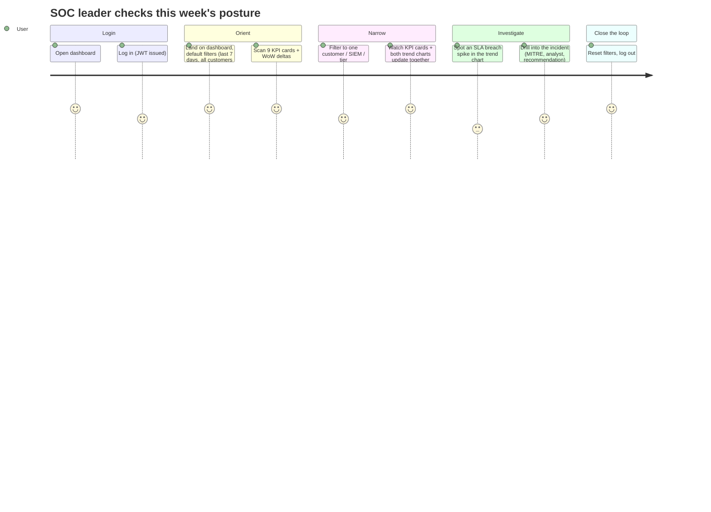
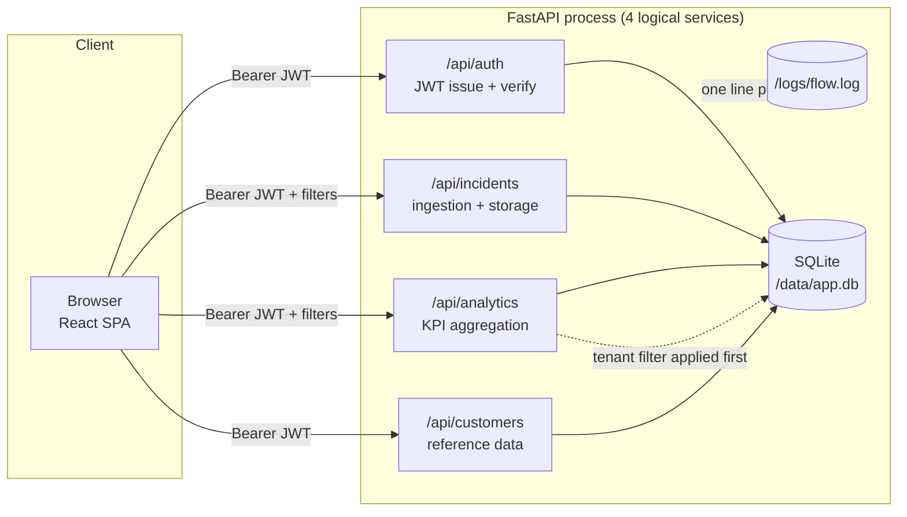
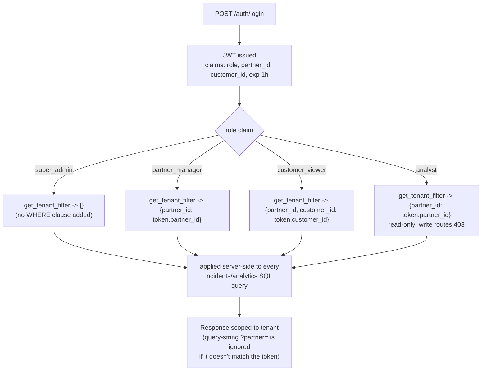

# Solution Architecture — SOC Executive Dashboard

_Filled by `solution-architect`. Every decision needs a WHY, not just a what._

## Stack
| Layer | Choice | WHY |
|---|---|---|
| Backend | FastAPI (single process, logically 4 services) | Async request handling matters here — the analytics endpoint aggregates over up to 90 days / 5,000 rows on every filter change, and FastAPI's async I/O keeps that from blocking other tenants' requests. One process is a 4-hour build decision, not an architecture ceiling — see below. |
| Database | SQLite, file-based (`/data/app.db`) | One file, trivial to seed/reset/back up for a demo, zero infra to stand up in a 4-hour window. `DB_TYPE` env toggle (`sqlite` default, `mongo` stubbed) documents the migration path without spending build time on it. |
| Frontend | React + Vite + Recharts | Recharts gives production-looking weekly trend lines/bars with minimal code — the right trade for a 4-hour build where KPI correctness matters more than a custom charting layer. |
| Auth | JWT (1h expiry, bcrypt) | Stateless — no server-side session store needed, which matters because tenant scope (`partner_id`/`customer_id`) travels inside the token claims and is re-checked on every request. |

### Why "microservices" but one FastAPI process
The API is organized as four logical services — `/api/auth`, `/api/incidents`,
`/api/analytics`, `/api/customers` — each with its own router, own repository, own
service-layer module. In a 4-hour hackathon window, standing up four separate
containers (four Dockerfiles, service discovery, inter-service auth) burns build
time on infrastructure instead of on KPI correctness and RBAC, which are what's
actually being judged. The logical boundary is real, though: each router only calls
its own service module, no cross-router imports. Splitting `auth-service`,
`incidents-service`, `analytics-service`, `customers-service` into four containers
later is a docker-compose and repository-per-folder exercise, not a rewrite — this
is the sellable part: "same code, one process today, four containers whenever your
ops team wants that."

## Diagram 1 — User Journey


## Diagram 2 — System Architecture


## Diagram 3 — RBAC Flow


## RBAC Matrix
| Role | Partner Scope | Customer Scope | Can see filters | Can drill-down | Can see PII |
|---|---|---|---|---|---|
| `super_admin` | `*` (all partners) | `*` (all customers) | all | yes | yes |
| `partner_manager` | `partner_id = <own>` | all customers within own partner | all, pre-scoped to own partner | yes | yes |
| `customer_viewer` | `partner_id = <own>` | `customer_id = <own>` only | range/SIEM/SOAR/tier only (customer is fixed) | yes, own customer only | yes, own customer only |
| `analyst` | `partner_id = <own>` | all customers within own partner | all, pre-scoped to own partner | yes | yes (read-only elsewhere: no `/admin`, no writes) |

`get_tenant_filter(current_user)` is the single function every repository query
runs through — it returns a dict merged into the SQL WHERE clause server-side. A
query-string `?partner=` that doesn't match the token's own scope is **ignored**,
not honored — this is what makes tenant isolation a server-side guarantee instead
of a client convention.

## DB Schema (SQLite)

```sql
CREATE TABLE users (
    id INTEGER PRIMARY KEY AUTOINCREMENT,
    username TEXT UNIQUE NOT NULL,
    password_hash TEXT NOT NULL,              -- bcrypt
    role TEXT NOT NULL CHECK(role IN ('super_admin','partner_manager','customer_viewer','analyst')),
    partner_id TEXT,                          -- NULL only for super_admin
    customer_id TEXT                          -- NULL unless role = customer_viewer
);

CREATE TABLE customers (
    id INTEGER PRIMARY KEY AUTOINCREMENT,
    customer_id TEXT UNIQUE NOT NULL,
    customer_name TEXT NOT NULL,
    partner_id TEXT NOT NULL,
    service_tier TEXT NOT NULL CHECK(service_tier IN ('Gold','Silver','Bronze')),
    siem TEXT NOT NULL CHECK(siem IN ('QRADAR','XSIAM')),
    soar TEXT NOT NULL CHECK(soar IN ('XSOAR','Resilient'))
);

CREATE TABLE incidents (
    id INTEGER PRIMARY KEY AUTOINCREMENT,
    ticket_number TEXT UNIQUE NOT NULL,
    partner TEXT NOT NULL,
    customer TEXT NOT NULL,
    severity TEXT NOT NULL CHECK(severity IN ('Critical','Major','Minor','Informational')),
    status TEXT NOT NULL,
    service_type TEXT NOT NULL,
    siem TEXT NOT NULL,
    soar TEXT NOT NULL,
    sla_result TEXT CHECK(sla_result IN ('Matched','Breached','none')),
    event_time TEXT NOT NULL,                 -- ISO8601
    created_time TEXT NOT NULL,
    opened_time TEXT,                         -- NULL if never opened
    first_response_time TEXT,                 -- NULL if never responded
    closed_time TEXT,                         -- NULL if still open
    assigned_analyst TEXT,
    category TEXT,
    summary TEXT,
    mitre_techniques TEXT,                    -- comma-separated
    false_positive INTEGER NOT NULL DEFAULT 0 -- boolean 0/1
);
```

`DB_TYPE=sqlite` (default) or `DB_TYPE=mongo` env var selects the repository
implementation — the service layer (`analytics_service.py`) never touches SQL/Mongo
directly, only the repository interface, so the KPI math doesn't change when the
storage does.

## KPI Computation Logic — assumptions documented

All computed in `compute_kpis(filters)` in `app/services/analytics_service.py`,
against whatever `[from, to]` range + tenant filter + customer/SIEM/SOAR/tier
filters are active.

| KPI | Formula | Assumption |
|---|---|---|
| **Alerts** | `COUNT(*) WHERE created_time BETWEEN from AND to` | Every row that reaches SecurityHub counts as an alert, regardless of whether it becomes an incident |
| **Critical Alerts** | Alerts `WHERE severity = 'Critical'` | — |
| **Incidents** | `COUNT(*) WHERE opened_time IS NOT NULL AND created_time BETWEEN from AND to` | The alert→incident funnel: an alert only becomes a counted "incident" once an analyst opens it |
| **Avg MTTD** | `AVG(created_time - event_time)`, minutes, incidents with both times | MTTD = detection latency: how long between the SIEM seeing it (`event_time`) and SecurityHub creating the ticket (`created_time`) |
| **Avg MTTR** | `AVG(closed_time - opened_time)`, hours, `WHERE closed_time IS NOT NULL` | Only closed incidents count — an open incident has no resolution time yet, including it would bias MTTR down |
| **SLA Compliance %** | `Matched / (Matched + Breached) * 100` | `sla_result = 'none'` (never opened) is excluded entirely — you can't breach an SLA clock that never started |
| **SLA Breaches** | `COUNT(*) WHERE sla_result = 'Breached'` | — |
| **False-Positive Rate** | `COUNT(*) WHERE false_positive = true / Alerts * 100` | A row is flagged false-positive if it was closed in under 15 minutes without ever being opened, OR an analyst explicitly marked it — both cases are pre-computed into the `false_positive` column at seed/ingest time, not derived at query time. Seed data targets 15% |
| **P1/P2/P3 Avg Response** | Map `Critical→P1, Major→P2, Minor→P3`; `AVG(first_response_time - opened_time)` per bucket | Informational severity has no P-bucket and isn't included in this KPI |
| **Week-over-week delta** | `(current_week - previous_week) / previous_week * 100` | Computed identically for every KPI above, using the same filter set shifted back 7 days; division-by-zero (previous_week = 0) reports `null`, rendered as "—" not "∞%" |

## API Contract

| Method | Path | Purpose |
|---|---|---|
| `POST` | `/api/auth/login` | Sync login — returns JWT immediately |
| `POST` | `/api/auth/login-async` | Async login — returns `job_id`, poll for result |
| `GET` | `/api/auth/status/{job_id}` | Poll result of an async login |
| `GET` | `/api/auth/me` | Current user's identity + scope (role, partner_id, customer_id) |
| `GET` | `/api/incidents` | List incidents — query params: `customer, siem, soar, tier, from, to, partner` (tenant-filtered server-side regardless of `partner` param) |
| `GET` | `/api/analytics/kpis` | Same filters → all 9 KPIs + WoW deltas |
| `GET` | `/api/analytics/trends` | `?metric=volume\|mttr&bucket=weekly` → weekly-bucketed series |
| `GET` | `/api/incidents/{id}` | Drill-down: full incident detail incl. MITRE techniques, analyst, recommendation |
| `GET` | `/api/customers` | Reference data — customers visible to the caller's tenant scope |
| `GET` | `/health` | Liveness — used by `devops/deploy.sh` and the demo |
| `POST` | `/demo/reset` | Re-seed demo data on demand |
| `GET` | `/test-report` | Serves `testcases/test_report.html` |
| `GET` | `/flow` | Last 5 lines of `/logs/flow.log` — proves the JWT/RBAC flow live |
