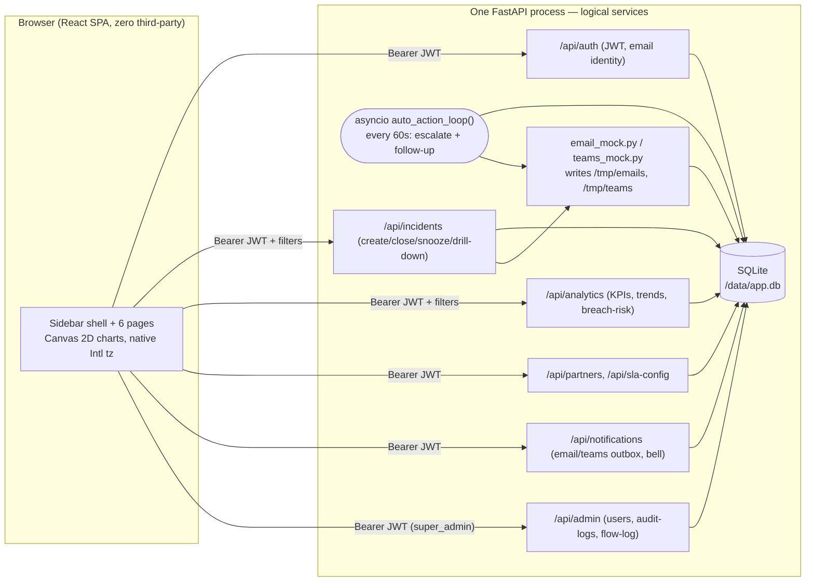

# PulseSOC — SOC Executive Command Center

A single-pane, multi-tenant executive dashboard for an MSSP SOC — global filters,
9 KPI cards with week-over-week deltas and sparklines, incident drill-down, and
two signature features (SLA Breach Predictor with live blinking/snooze/auto-escalation,
and Partner Registration + SLA Configuration), all scoped server-side by role
(super_admin, partner_manager, customer_viewer, analyst). Built against
`docs/SOC_Executive_Dashboard_Problem_Final.docx` (HACK-SOC-01).

**Zero third-party runtime dependencies.** No dayjs, no chart library, no email/Teams
SDK. Timezone conversion uses native `Intl.DateTimeFormat`; every chart is hand-rolled
Canvas 2D (`ChartCard.jsx`); email/Teams notifications are mocked to local files
(`/tmp/emails`, `/tmp/teams`) plus DB outbox rows — fully offline, no network calls out.
Only React/Vite/FastAPI/SQLite/PyJWT/bcrypt and Python stdlib.

Full architecture, RBAC matrix, DB schema, and KPI formula-by-formula assumptions
are in [`02_SOLUTION_ARCHITECTURE_TEMPLATE.md`](02_SOLUTION_ARCHITECTURE_TEMPLATE.md).
Framework rules (logging, git flow, JWT/RBAC spec) are in [`CLAUDE.md`](CLAUDE.md).

## Layout

An enterprise sidebar shell (`Layout.jsx`, 260px fixed dark sidebar + 60px top bar
with the global filter/theme/timezone/bell/Command Center controls), 6 routed pages:

| Page | Route | What it shows |
|---|---|---|
| Dashboard | `/` | Charts only — Alerts Trend, Severity Breakdown, Top Customers, SIEM vs SOAR, Breach Predictor summary widget. Every chart is clickable and drills into a filtered Incidents view. |
| SLA Breach Predictor | `/breach-predictor` | War Room banner, Early Warning table, Breach Risk by Customer chart. |
| Partner Management | `/partners` | Register Partner, Configure SLA, Demo Setup wizard. |
| Notifications | `/notifications` | Email Outbox, Teams Outbox, Bell History — file-backed proof of every mock send. |
| Incidents | `/incidents` | Full drill-down table: filters, chips, search, sort, pagination, row modal with Details/Timeline/Email/Teams tabs and Resolve/Snooze/Send Email actions. |
| Admin | `/admin` (super_admin only) | Users, audit logs, `flow.log` viewer, embedded test report. |

## Signature features

- **SLA Breach Predictor** — `risk_score = pct_elapsed×0.6 + severity_weight×0.3 +
  (breach_history×5)×0.1`. A Critical incident with ≤5 min left (or Major with
  ≤15 min) is `BLINKING`, driving the war-room banner and a blinking ticket chip.
  Snoozing suppresses blinking until the snooze expires; an `asyncio` background
  loop (`auto_action.py`, checking every 60s — no Celery) auto-escalates breached
  tickets and opens a `FOLLOWUP-*` ticket if a breach goes unresolved for 10+ minutes.
- **Partner Registration + SLA Configuration** — register a partner (auto-provisions
  a mock Teams webhook URL), onboard a customer, set a per-severity SLA override,
  all through the UI — or the `Demo Setup` wizard, which does all four steps in
  about a minute.
- **Notifications (mocked, zero third-party)** — Critical-incident creation, breach
  escalation, and manual sends write a real `.eml`/`.json` file to disk plus an
  outbox DB row. No SMTP, no webhook POST — verifiable by a judge without network
  access.

## Architecture at a glance



## Run it

### Local (no Docker)
```bash
pip install -r backend/requirements.txt
python backend/seed.py                 # 2,000 incidents, 5 customers, 4 users
cd frontend && npm install && npm run build && cd ..
cd backend && uvicorn app.main:app --host 0.0.0.0 --port 8000
```
Open http://localhost:8000

### Docker + k8s (one command)
```bash
devops/deploy.sh
```
Builds the image, seeds data, runs the qe-guardian test suite, brings up
`docker-compose` on **:8000**, then loads the image into the local k8s cluster and
exposes it on **:30080**. See [`devops/deploy.sh`](devops/deploy.sh) for the exact
sequence — it's the same one used to verify this build.

## Demo accounts

| Email | Password | Role | Scope |
|---|---|---|---|
| `superadmin@pulsesoc.local` | `Admin@123` | `super_admin` | all partners, all customers |
| `partner_mgr@pulsesoc.local` | `Partner@123` | `partner_manager` | partner-a only |
| `customer_viewer@pulsesoc.local` | `Customer@123` | `customer_viewer` | partner-a / customer-1 only |
| `analyst@pulsesoc.local` | `Analyst@123` | `analyst` | partner-a, read-only |

Log in as each in turn — the sidebar nav and the dashboard's data visibly narrow
with the role (`Partner Management` and `Admin` disappear for non-privileged roles).
This is deliberately the most convincing 30 seconds of the demo: tenant scope comes
from the JWT (8h expiry — a SOC analyst's shift), not from anything the client sends.

## The 60-second live demo

From `/partners`, click **Demo Setup** to run all four steps live in front of
judges — no pre-baked data:
1. Register a new partner (auto-provisions a mock Teams webhook)
2. Onboard a customer under it
3. Set a 5-minute Critical SLA (deliberately short, for the demo)
4. Create a Critical ticket — it shows up **blinking** in the war-room banner and
   the Early Warning table immediately, and a real email + Teams mock file lands
   in `/tmp/emails` / `/tmp/teams` (visible live on the `/notifications` page)

Then open the ticket from `/incidents` and hit **Resolve**: toast "SLA saved with
N min left!", confetti, and the KPI cards refresh live, no reload.
Every step is logged to `logs/flow.log` (viewable live on `/admin`).

## Proof endpoints

| Endpoint | What it shows |
|---|---|
| `/health` | Liveness |
| `/flow` | Last 5 lines of the live JWT/RBAC/ticket/SLA request trace (`logs/flow.log`) |
| `/test-report` | qe-guardian's generated test report (`testcases/test_report.html`) — also embedded in `/admin` |
| `/api/admin/flow-log` (super_admin only) | Last 100 lines of `flow.log`, for the Admin page's live viewer |
| `/demo/reset` (POST, super_admin only) | Re-seeds demo data on demand |
| `/tmp/emails/*.eml`, `/tmp/teams/*.json` | Real files written by the zero-third-party notification mocks |

## KPI assumptions (short version — full table in `02_SOLUTION_ARCHITECTURE_TEMPLATE.md`)

- **Alerts** = every row created in the range, before any funnel filtering.
- **Incidents** = alerts that were actually opened (the alert→incident funnel).
- **Avg MTTD** = `created_time - event_time` (detection latency).
- **Avg MTTR** = `closed_time - opened_time`, closed incidents only.
- **SLA Compliance %** excludes incidents never opened (`sla_result = 'none'`) from
  the denominator entirely.
- **False-Positive Rate** = incidents that were noise and never opened, over total
  alerts. Seed data targets 15%.
- **P1/P2/P3 Avg Response** maps Critical/Major/Minor → P1/P2/P3; Informational has
  no P-bucket.
- **Week-over-week delta** shifts the same filtered window back 7 days and compares.
- **Date range** defaults to the last 90 days and is capped there server-side —
  `analytics_service.MAX_RANGE_DAYS` — a wider request gets a 400, not a slow query.
- **SLA breach risk** targets default to Critical=4h/Major=8h/Minor=24h but can be
  overridden per partner or per customer via `/api/sla-config`.

## Sample data

`backend/seed.py` generates 90 days of data across 5 customers (relative to
whenever it's run, not fixed dates) with a volume spike in the last 14 days and
realistic ops hygiene — closure likelihood scales with age, and Critical
incidents mostly resolve inside their SLA — so the breach predictor shows a
genuine spread instead of everything pinned at one extreme. Exports the first
200 rows to [`docs/incident_sample.csv`](docs/incident_sample.csv) for reference.

## Testing

`backend/test_runner.py` runs 18 test cases in-process against the seeded database
(no live server needed) — login, RBAC, tenant isolation, KPI math, breach-predictor
math, live ticket creation, SLA config overrides, blinking-critical detection,
snooze suppression, the close-ticket SLA-saved flow, the zero-third-party
email-outbox mock, and admin-only `flow.log` RBAC — all cross-checked directly
against raw SQL. Results land in `testcases/TEST_CASE_TRACKER.csv`, `testcases/test_report.html`,
and `logs/test.log`, and get pushed to Kiwi TCMS (`testcases/kiwi_push.log` records
the outcome either way).

```bash
python backend/test_runner.py
```

## What's out of scope (by design)

- Real SIEM/SOAR integrations — data is generated, not pulled live.
- Real SMTP/Teams webhook delivery — mocked to local files + DB outbox rows, per
  the zero-third-party / air-gapped mandate.
- Postgres/production database — SQLite for the demo (`DB_TYPE` env toggle documents
  the migration path).
- Four separate containers — logically split services, physically one FastAPI
  process (see the "why" in `02_SOLUTION_ARCHITECTURE_TEMPLATE.md`).
- Real audio for the blinking alert — a visual flash + red top-bar animation only,
  per the brief.
