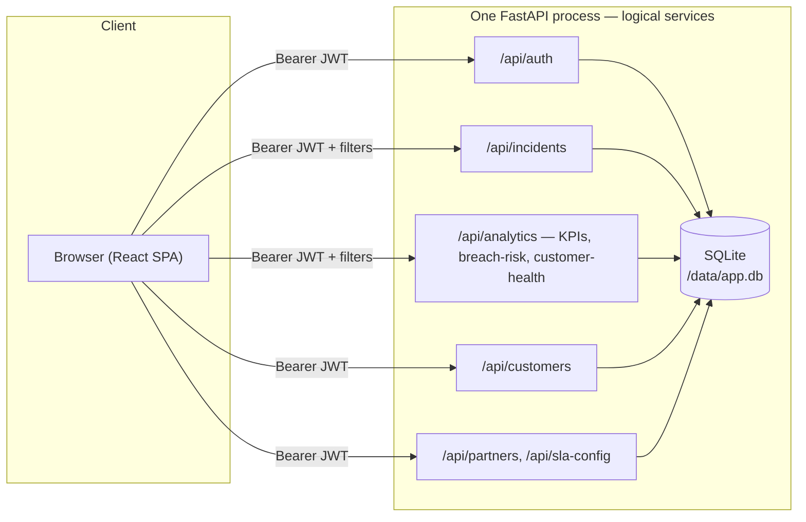

# PulseSOC — SOC Executive Command Center

A single-pane, multi-tenant executive dashboard for a multi-tenant MSSP SOC —
global filters, 9 KPI cards with week-over-week deltas, two weekly trend charts,
incident drill-down, and three signature features (SLA Breach Predictor, Customer
Health Score, Live Command Center Mode), all scoped server-side by role
(super_admin, partner_manager, customer_viewer, analyst). Built against
`docs/SOC_Executive_Dashboard_Problem_Final.docx` (HACK-SOC-01).

Full architecture, RBAC matrix, DB schema, and KPI formula-by-formula assumptions
are in [`02_SOLUTION_ARCHITECTURE_TEMPLATE.md`](02_SOLUTION_ARCHITECTURE_TEMPLATE.md).
Framework rules (logging, git flow, JWT/RBAC spec) are in [`CLAUDE.md`](CLAUDE.md).

## Signature features

- **SLA Breach Predictor** — forward-looking, not backward-looking. Every open
  incident's SLA target (configurable per partner/customer), elapsed time, and
  countdown are recomputed live. A Critical incident with ≤5 min left (or Major
  with ≤15 min) is flagged `blinking_critical`, driving a war-room-style blinking
  ticket chip and a red top-of-page banner with a live 1-second countdown.
- **Customer Health Score** — one QBR-ready number per customer:
  `100 − (breaches×12) − (fp_rate×0.6) − (avg_mttr_h×1.5)`, clamped 0–100, over a
  30-day window. Click a card to filter the whole dashboard to that customer.
- **Live Command Center Mode** — full-screen, dark, auto-refreshing every 10s.
  KPI cards pulse when a value changes; a bottom ticker scrolls recent incident
  activity war-room-marquee style.
- **Partner Registration + SLA Configuration** — register a new partner, onboard a
  customer under it, and set a custom SLA target per severity, all through the UI
  (or the `Demo Setup` wizard, which does all four steps — register, onboard,
  configure, create a ticket — in about a minute).

## Architecture at a glance



## Run it

### Local (no Docker)
```bash
pip install -r backend/requirements.txt
python backend/seed.py                 # 5,000 incidents, 20 customers, 4 users
cd frontend && npm install && npm run build && cd ..
cd backend && uvicorn app.main:app --host 0.0.0.0 --port 8000
```
Open http://localhost:8000

### Docker + k8s (one command)
```bash
devops/deploy.sh
```
Builds the image, seeds data, runs the qe-guardian test suite, brings up
`docker-compose` on **:8000**, then loads the image into the local k8s cluster and
exposes it on **:30080**. See [`devops/deploy.sh`](devops/deploy.sh) for the exact
sequence — it's the same one used to verify this build.

## Demo accounts

| Username | Password | Role | Scope |
|---|---|---|---|
| `superadmin` | `Admin@123` | `super_admin` | all partners, all customers |
| `partner_mgr` | `Partner@123` | `partner_manager` | partner-a only |
| `customer_viewer` | `Customer@123` | `customer_viewer` | partner-a / customer-1 only |
| `analyst` | `Analyst@123` | `analyst` | partner-a, read-only |

Log in as each in turn — the dashboard's data (and the `/admin` / `Partner Management`
links) visibly narrow with the role. This is deliberately the most convincing 30
seconds of the demo: tenant scope comes from the JWT, not from anything the client
sends.

## The 60-second live demo

Click **Demo Setup** (super_admin, top right) to run all four steps live in front of
judges — no pre-baked data:
1. Register a new partner
2. Onboard a customer under it
3. Set a 5-minute Critical SLA (deliberately short, for the demo)
4. Create a Critical ticket — it shows up **blinking** in the Early Warning table
   immediately, since 5 minutes elapsed is already the whole SLA budget

Then hit **Close / Resolve Now** before the countdown runs out: toast "SLA saved
with N min left!", confetti, and the KPI cards / health score refresh live, no
reload. Every step is logged to `logs/flow.log`.

## Proof endpoints

| Endpoint | What it shows |
|---|---|
| `/health` | Liveness |
| `/flow` | Last 5 lines of the live JWT/RBAC/ticket/SLA request trace (`logs/flow.log`) |
| `/test-report` | qe-guardian's generated test report (`testcases/test_report.html`) |
| `/demo/reset` (POST, super_admin only) | Re-seeds demo data on demand |

## KPI assumptions (short version — full table in `02_SOLUTION_ARCHITECTURE_TEMPLATE.md`)

- **Alerts** = every row created in the range, before any funnel filtering.
- **Incidents** = alerts that were actually opened (the alert→incident funnel).
- **Avg MTTD** = `created_time - event_time` (detection latency).
- **Avg MTTR** = `closed_time - opened_time`, closed incidents only.
- **SLA Compliance %** excludes incidents never opened (`sla_result = 'none'`) from
  the denominator entirely.
- **False-Positive Rate** = incidents that were noise and never opened, over total
  alerts. Seed data targets 15%.
- **P1/P2/P3 Avg Response** maps Critical/Major/Minor → P1/P2/P3; Informational has
  no P-bucket.
- **Week-over-week delta** shifts the same filtered window back 7 days and compares.
- **Date range** defaults to the last 90 days and is capped there server-side —
  `analytics_service.MAX_RANGE_DAYS` — a wider request gets a 400, not a slow query.
- **SLA breach risk** targets default to Critical=4h/Major=8h/Minor=24h but can be
  overridden per partner or per customer via `/api/sla-config`.

## Sample data

`backend/seed.py` generates 90 days of data (relative to whenever it's run, not
fixed dates) with a volume spike in the last 14 days and realistic ops hygiene —
closure likelihood scales with age, and Critical incidents mostly resolve inside
their SLA — so the breach predictor and health score both show a genuine spread
instead of everything pinned at one extreme. Exports the first 200 rows to
[`docs/incident_sample.csv`](docs/incident_sample.csv) for reference.

## Testing

`backend/test_runner.py` runs 16 test cases in-process against the seeded database
(no live server needed) — login, RBAC, tenant isolation, KPI math, breach-predictor
math, customer-health-score math, live ticket creation, SLA config overrides,
blinking-critical detection, and the close-ticket SLA-saved flow, all cross-checked
directly against raw SQL. Results land in `testcases/TEST_CASE_TRACKER.csv`,
`testcases/test_report.html`, and `logs/test.log`, and get pushed to Kiwi TCMS
(`testcases/kiwi_push.log` records the outcome either way).

```bash
python backend/test_runner.py
```

## What's out of scope (by design)

- Real SIEM/SOAR integrations — data is generated, not pulled live.
- Postgres/production database — SQLite for the demo (`DB_TYPE` env toggle documents
  the migration path).
- Four separate containers — logically split services, physically one FastAPI
  process (see the "why" in `02_SOLUTION_ARCHITECTURE_TEMPLATE.md`).
- Real audio for the blinking alert — a visual flash + red top-bar animation only,
  per the brief.
