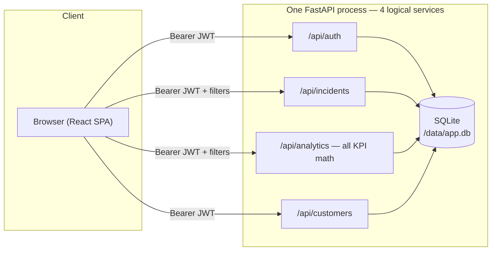

# SOC Executive Dashboard

A single-pane, multi-tenant executive dashboard for a multi-tenant MSSP SOC —
global filters, 9 KPI cards with week-over-week deltas, two weekly trend charts,
and incident drill-down, all scoped server-side by role (super_admin,
partner_manager, customer_viewer, analyst). Built against
`docs/SOC_Executive_Dashboard_Problem_Final.docx` (HACK-SOC-01).

Full architecture, RBAC matrix, DB schema, and KPI formula-by-formula assumptions
are in [`02_SOLUTION_ARCHITECTURE_TEMPLATE.md`](02_SOLUTION_ARCHITECTURE_TEMPLATE.md).
Framework rules (logging, git flow, JWT/RBAC spec) are in [`CLAUDE.md`](CLAUDE.md).

## Architecture at a glance



## Run it

### Local (no Docker)
```bash
pip install -r backend/requirements.txt
python backend/seed.py                 # 5,000 incidents, 20 customers, 4 users
cd frontend && npm install && npm run build && cd ..
cd backend && uvicorn app.main:app --host 0.0.0.0 --port 8000
```
Open http://localhost:8000

### Docker + k8s (one command)
```bash
devops/deploy.sh
```
Builds the image, seeds data, runs the qe-guardian test suite, brings up
`docker-compose` on **:8000**, then loads the image into the local k8s cluster and
exposes it on **:30080**. See [`devops/deploy.sh`](devops/deploy.sh) for the exact
sequence — it's the same one used to verify this build.

## Demo accounts

| Username | Password | Role | Scope |
|---|---|---|---|
| `superadmin` | `Admin@123` | `super_admin` | all partners, all customers |
| `partner_mgr` | `Partner@123` | `partner_manager` | partner-a only |
| `customer_viewer` | `Customer@123` | `customer_viewer` | partner-a / customer-1 only |
| `analyst` | `Analyst@123` | `analyst` | partner-a, read-only |

Log in as each in turn — the dashboard's data (and the `/admin` link) visibly
narrows with the role. This is deliberately the most convincing 30 seconds of the
demo: tenant scope comes from the JWT, not from anything the client sends.

## Proof endpoints

| Endpoint | What it shows |
|---|---|
| `/health` | Liveness |
| `/flow` | Last 5 lines of the live JWT/RBAC request trace (`logs/flow.log`) |
| `/test-report` | qe-guardian's generated test report (`testcases/test_report.html`) |
| `/demo/reset` (POST, super_admin only) | Re-seeds demo data on demand |

## KPI assumptions (short version — full table in `02_SOLUTION_ARCHITECTURE_TEMPLATE.md`)

- **Alerts** = every row created in the range, before any funnel filtering.
- **Incidents** = alerts that were actually opened (the alert→incident funnel).
- **Avg MTTD** = `created_time - event_time` (detection latency).
- **Avg MTTR** = `closed_time - opened_time`, closed incidents only.
- **SLA Compliance %** excludes incidents never opened (`sla_result = 'none'`) from
  the denominator entirely.
- **False-Positive Rate** = incidents that were noise and never opened, over total
  alerts. Seed data targets 15%.
- **P1/P2/P3 Avg Response** maps Critical/Major/Minor → P1/P2/P3; Informational has
  no P-bucket.
- **Week-over-week delta** shifts the same filtered window back 7 days and compares.

## Sample data

`backend/seed.py` generates 90 days of data with a volume spike in the last 14 days
(so the trend chart shows a visible recent uptick) and exports the first 200 rows to
[`docs/incident_sample.csv`](docs/incident_sample.csv) for reference.

## Testing

`backend/test_runner.py` runs 10 test cases in-process against the seeded database
(no live server needed) — login, RBAC, tenant isolation, and KPI math cross-checked
directly against the raw SQL. Results land in `testcases/TEST_CASE_TRACKER.csv`,
`testcases/test_report.html`, and `logs/test.log`, and get pushed to Kiwi TCMS
(`testcases/kiwi_push.log` records the outcome either way).

```bash
python backend/test_runner.py
```

## What's out of scope (by design, for a 4-hour build)

- Real SIEM/SOAR integrations — data is generated, not pulled live.
- Postgres/production database — SQLite for the demo (`DB_TYPE` env toggle documents
  the migration path).
- Four separate containers — logically 4 services, physically one FastAPI process
  (see the "why" in `02_SOLUTION_ARCHITECTURE_TEMPLATE.md`).
